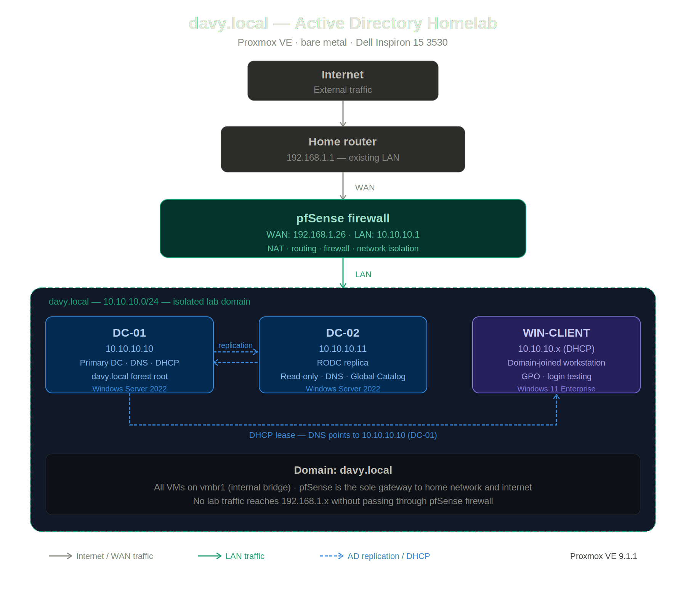

# Davy.Local — Active Directory Domain Infrastructure

> A self-directed homelab project building a fully functional Active Directory environment from scratch, designed to simulate enterprise network architecture and develop hands-on IT infrastructure skills.

**Built by:** Jonathon Alexander Daniel  
**Status:**  

---

## Network Diagram



---

## Overview

This project builds a fully isolated Active Directory domain (`davy.local`) running on bare metal Proxmox VE, with pfSense providing network segmentation between the lab environment and the home network. The goal was to develop a deep understanding of enterprise directory services, network isolation, and the infrastructure decisions that real IT environments are built on.

Every component was configured from scratch — no pre-built templates, no shortcuts. The build was fully documented throughout, including failed attempts, root cause analysis, and the architectural decisions made along the way.

---

## Lab Environment

**Hypervisor:** Proxmox VE 9.1.1 — bare metal  
**Host hardware:** Dell Inspiron 15 3530 — 6 cores · 8 GB RAM · 512 GB SSD  
**Domain:** `davy.local`  
**Lab subnet:** `10.10.10.0/24` (fully isolated from home network)

---

## Virtual Machine Architecture

| VM | Role | IP | OS | vCPU | RAM |
|---|---|---|---|---|---|
| pfSense | Firewall · NAT · routing | WAN: 192.168.1.26 · LAN: 10.10.10.1 | pfSense CE 2.7.2 | 1 | 2 GB |
| DC-01 | Primary domain controller · DNS · DHCP | 10.10.10.10 | Windows Server 2022 | 2 | 2 GB |
| DC-02 | Read-only domain controller · DNS · Global Catalog | 10.10.10.11 | Windows Server 2022 | 1 | 2 GB |
| WIN-CLIENT | Domain-joined workstation | 10.10.10.x (DHCP) | Windows 11 Enterprise | 2 | 2 GB |

---

## Network Architecture

The lab network is fully isolated from the home network using pfSense as the sole gateway. No lab traffic reaches the `192.168.1.x` home subnet without passing through the pfSense firewall.

```
Internet
    │
Home router (192.168.1.1)
    │
pfSense WAN (192.168.1.26)
pfSense LAN (10.10.10.1)        ← sole gateway in/out of lab
    │
    ├── DC-01  (10.10.10.10)    Primary DC · DNS · DHCP
    ├── DC-02  (10.10.10.11)    RODC replica
    └── WIN-CLIENT (10.10.10.x) Domain-joined workstation
```

**Proxmox bridge configuration:**
- `vmbr0` — bridged to physical NIC, carries WAN traffic to pfSense
- `vmbr1` — internal only, no physical NIC, carries all lab LAN traffic

**DNS chain:**
All lab VMs point to DC-01 (`10.10.10.10`) as their DNS server. DC-01 resolves `davy.local` internally and forwards all external queries to pfSense (`10.10.10.1`), which forwards to the internet.

---

## Build Journey

### Initial approach — Proxmox inside VirtualBox

The first attempt ran Proxmox VE as a guest inside Oracle VirtualBox on a Windows host. This introduced compounding nested virtualization problems:

- VirtualBox's bridged adapter required promiscuous mode to pass traffic to nested VMs
- pfSense WAN consistently failed to obtain a DHCP lease despite correct bridge configuration
- Windows 11 VM experienced UEFI boot loops caused by nested virtualization conflicts
- VirtIO drivers behaved unreliably in the nested environment

After diagnosing the root cause — Proxmox is a Type 1 hypervisor designed to run on bare metal, not as a guest inside a Type 2 hypervisor — the decision was made to migrate to a dedicated machine.

### Migration to bare metal

A Dell Inspiron 15 3530 was repurposed as a dedicated Proxmox host. Moving to bare metal immediately resolved every networking and driver issue. This experience produced a clear understanding of the architectural difference between Type 1 and Type 2 hypervisors and why that distinction matters in practice.

### pfSense network segmentation challenge

A subnet conflict arose when both the pfSense WAN (`192.168.1.x`) and LAN were configured on the same subnet. pfSense has a built-in protection that blocks web UI access when WAN and LAN share the same address space. Resolving this required understanding the purpose of network segmentation and reconfiguring the LAN to a separate subnet (`10.10.10.0/24`), which is now the isolated lab network.

### RODC permissions discovery

During verification of DC-02 as a Read-Only Domain Controller, write operations appeared to succeed when authenticated as `DAVY\Administrator`. Investigation revealed this is expected behavior — Domain Admins have a built-in exemption that bypasses RODC read-only restrictions. The RODC restriction applies to standard domain users, not privileged accounts. This was verified using:

```powershell
Get-ADDomainController -Filter * | Select-Object Name, IsReadOnly
```

---

## Key Technical Concepts Developed

- **Hypervisor architecture** — practical understanding of Type 1 vs Type 2 hypervisors and their real-world implications for nested virtualization
- **Network segmentation** — designing isolated lab networks using pfSense with separate WAN/LAN subnets and internal-only virtual bridges
- **Active Directory architecture** — forest/domain structure, domain controller promotion, DNS dependency, SRV records, and replication
- **RODC design** — read-only domain controller purpose, replication behavior, and the permission model that governs administrative exemptions
- **DNS hierarchy** — how AD DNS, internal forwarders, and external resolution chain together across a domain environment
- **Thin provisioning** — LVM-Thin storage in Proxmox, real vs allocated disk usage, and snapshot delta storage
- **PKI foundations** — understanding certificate requirements (TPM 2.0, UEFI) for Windows 11 deployment

---

## Verification Commands

Commands used to confirm the environment is healthy:

```powershell
# Verify DNS health across all domain controllers
dcdiag /test:dns

# Confirm replication status between DC-01 and DC-02
repadmin /replsummary

# Verify RODC read-only status
Get-ADDomainController -Filter * | Select-Object Name, IsReadOnly

# Confirm domain join and GPO application on WIN-CLIENT
gpresult /r
```

---

## Documentation

Full build log including timestamped attempt history, failure analysis, VM specifications, network configuration decisions, and verification checklists:

📄 [`Active_Directory_Homelab.md`](Active_Directory_Homelab.md)

---

## Roadmap

### Tier 1 — Core infrastructure ✅
- [x] Proxmox VE bare metal installation
- [x] pfSense firewall and network segmentation
- [x] DC-01 — primary domain controller, DNS, DHCP
- [x] DC-02 — read-only domain controller, replication
- [x] WIN-CLIENT — domain-joined workstation

### Tier 2 — Attack & defense (upcoming)
- [ ] Kali Linux attack VM
- [ ] BloodHound — Active Directory attack path visualization
- [ ] Impacket — Kerberoasting and Pass-the-Hash simulation
- [ ] Wazuh SIEM — log collection and threat detection
- [ ] Sysmon — enhanced Windows event logging

### Tier 3 — Identity & automation (planned)
- [ ] Keycloak — SAML/OAuth2 SSO federation
- [ ] ADCS — internal certificate authority
- [ ] Ansible — automated AD provisioning
- [ ] HashiCorp Vault — secret management and PKI

---

## Author

**Jonathon Alexander Daniel**  
Self-directed IT infrastructure and cybersecurity learner  

[](https://linkedin.com/in/https://www.linkedin.com/in/jonathon-daniel-624125327)

---

*Built from scratch. Documented throughout. Every failure was a lesson.*
